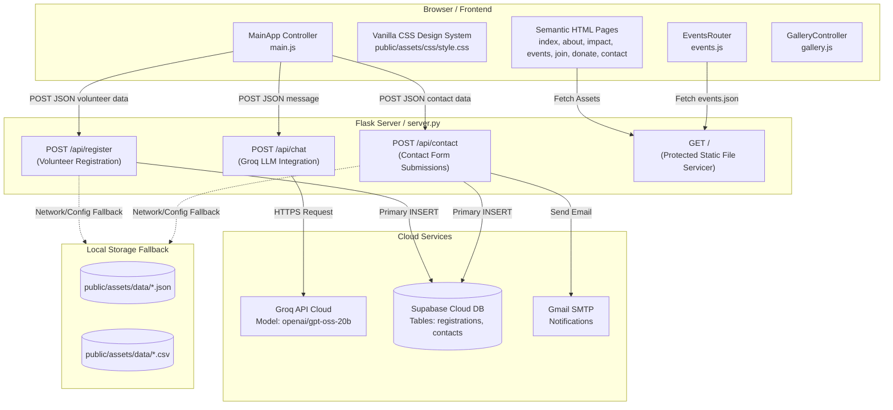

# Zanzavat Sanstha Web Application — Comprehensive Architecture & Development Blueprint

> **Notice for Developers & AI Agents**: This document is the definitive single source of truth for the **Zanzavat Bahuudeshiya Shaikshanik Sanstha** web platform. It contains complete architectural diagrams, data flows, API specifications, frontend module breakdowns, database schemas, performance standards, deployment procedures, and guidelines for ongoing development.

---

## 1. Executive Summary & Core Mission

- **Organization**: Zanzavat Bahuudeshiya Shaikshanik Sanstha
- **Headquarters**: Nagpur, Maharashtra, India
- **Mission**: Grassroots community upliftment focused on underprivileged child education (*शिक्षण*), healthcare & medical checkups (*सेवा*), student welfare, and resource distribution drives (*परिवर्तन*).
- **Core Metrics**:
  - **100+** Children Supported
  - **350+** Lives Impacted / Medical Assistance Delivered
  - **25+** Active Dedicated Volunteers
- **Platform Type**: Hybrid high-performance responsive web application consisting of a static/dynamic HTML5/CSS3/ES6+ frontend powered by a Python Flask microservice backend with cloud persistence (Supabase), resilient local file fallback (JSON/CSV), and real-time AI conversational assistance (Groq LLM).

---

## 2. Complete Technology Stack

| Layer | Technology | Purpose / Highlights |
|---|---|---|
| **Frontend Structure** | Semantic HTML5 | Clean SEO hierarchy (`<h1>`-`<h6>`), ARIA accessibility, preconnected typography, lazy-loaded media assets. |
| **Styling & Design System** | Vanilla CSS3 (`style.css`) | Custom properties (`:root`), dark luxury aesthetic (`#1A1A1A` charcoal, `#C82333` primary crimson, `#D4AF37` warm gold), glassmorphism, responsive grid & flexbox layouts. Render-blocking `@import` rules removed. |
| **Frontend Logic** | Vanilla ES6+ JavaScript | OOP architecture with specialized controllers (`MainApp`, `EventsRouter`, `GalleryController`), dynamic hash routing, smooth viewport IntersectionObservers. |
| **Backend Server** | Python 3.10+ / Flask 3.0+ | REST API routing, CORS handling, static asset serving with security file protection, async SMTP dispatch. |
| **Cloud Database** | Supabase (PostgreSQL) | Primary persistent relational cloud store for volunteer registrations and contact inquiries. |
| **Resilient Local Fallback** | JSON + CSV File System | Automatic zero-crash persistence: if cloud credentials are absent or network fails, data safely writes to `registrations.json`/`csv` and `contacts.json`/`csv`. |
| **AI Assistant** | Groq API (`openai/gpt-oss-20b`) | NGO chatbot answering visitor questions about programs, events, volunteer registration, and donation guidelines. |
| **Email Notification** | Flask-Mail (SMTP TLS 587) | Generates HTML email alerts for incoming contact inquiries. |
| **Production WSGI** | Gunicorn / Vercel Serverless | High concurrency Python execution. |

---

## 3. High-Level System Architecture



---

## 4. File Tree & Component Breakdown

```
Zanzavat-Sanstha-Web-page/
├── index.html                  # Home page: Hero slider, 3 key stat counters, programs preview, lazy video feed, AI chat
├── about.html                  # Organization history, core mission/vision cards, leadership profiles
├── impact.html                 # Quantitative impact stats (350+ medical, 100+ education, 15+ camps), story testimonials
├── events.html                 # Dynamic event list and hash-routed single-event deep-dive view
├── join.html                   # Volunteer registration form with validation and submit handler
├── donate.html                 # Donation tiers, transparency statement, QR code & bank transfer details
├── contact.html                # Get in touch contact form + direct phone/email/location info
├── server.py                   # Flask backend with CORS, endpoints, email templates, Supabase & local IO
├── requirements.txt            # Python dependencies (Flask, Flask-Mail, python-dotenv, gunicorn, supabase, requests)
├── vercel.json                 # Vercel serverless deployment routing config
├── progress_report.md          # THIS FILE — Primary architectural and onboarding guide
├── README.md                   # Public repository documentation
├── api/
│   └── index.py                # Serverless bridge for Vercel deployment
└── public/
    ├── robots.txt              # Search crawler instructions
    ├── sitemap.xml             # XML Sitemap for SEO indexing
    └── assets/
        ├── css/
        │   └── style.css       # Complete modular design system (~2400 lines)
        ├── js/
        │   ├── main.js         # Core application class (Mobile menu, sticky nav, stat counters, lazy video, AI chat)
        │   ├── events.js       # Dynamic hash-based events client router & renderer
        │   └── gallery.js      # Lightbox modal, masonry filter controller, horizontal spotlight slider
        ├── data/
        │   ├── events.json     # Curated database of past and upcoming NGO events & drives
        │   ├── registrations.json # Local fallback JSON storage for volunteers
        │   ├── registrations.csv  # Local fallback CSV storage for volunteers
        │   ├── contacts.json   # Local fallback JSON storage for inquiries
        │   └── contacts.csv    # Local fallback CSV storage for inquiries
        └── images/             # Fully compressed & optimized WebP assets (<8MB total)
            ├── hero/           # hero-1.webp, hero-2.webp, hero-3.webp
            ├── about/          # about-banner.webp, about-main.webp
            ├── impact/         # impact-banner.webp, story-1.webp, story-2.webp
            ├── education-support/ # edu-card.webp, edu-banner.webp, edu-focus.webp, kit-1..3.webp
            ├── medical-camps/  # med-card.webp, med-focus.webp, medical-camp-cover.webp, camp-1..3.webp
            ├── food-distribution/ # food-card.webp, food-focus.webp, food-drive-cover.webp, food-1..3.webp
            ├── clothing-drives/# clothing-focus.webp, clothing-1.webp
            ├── student-welfare/# welfare-focus.webp
            ├── volunteers/     # vol-banner.webp
            ├── leadership/     # ajinkya-bhakre.webp, aryaki-sontakke.webp
            ├── donations/      # donate-banner.webp
            ├── gallery/        # Video-1.mp4 through Video-6.mp4, spotlight-1..5.webp
            ├── logo/           # logo-placeholder.webp
            └── zanzavat-logo/  # zanzavat_logo.png
```

---

## 5. API Reference & Data Contracts

All endpoints accept and return `application/json` (unless serving static files).

### 5.1 POST `/api/register`
Submits volunteer registration data.

- **Request Body**:
```json
{
  "name": "Jane Doe",
  "email": "jane@example.com",
  "phone": "+91 98765 43210",
  "interest": "Education Support",
  "message": "Excited to teach on weekends!"
}
```
- **Validation**: `name`, `email`, and `phone` are strictly required.
- **Success Response (200 OK)**:
```json
{
  "status": "success",
  "message": "Thank you for registering as a volunteer! We will reach out soon."
}
```
- **Error Response (400 Bad Request)**:
```json
{
  "status": "error",
  "message": "Name, email, and phone number are required."
}
```

### 5.2 POST `/api/contact`
Submits a general inquiry or partnership request.

- **Request Body**:
```json
{
  "name": "John Smith",
  "email": "john@example.com",
  "phone": "+91 91234 56789",
  "subject": "Medical Camp Collaboration",
  "message": "We would like to partner for an upcoming health drive."
}
```
- **Validation**: `name`, `email`, and `message` are required.
- **Side Effect**: Attempts to send an HTML-formatted notification email to `zanzavatsanstha@gmail.com` via Gmail SMTP if credentials exist.
- **Success Response (200 OK)**:
```json
{
  "status": "success",
  "message": "Thank you for contacting us! We will get back to you shortly."
}
```

### 5.3 POST `/api/chat`
Proxies user conversational prompts to the Groq LLM with a specialized NGO system prompt.

- **Request Body**:
```json
{
  "message": "What programs do you offer for children?"
}
```
- **Success Response (200 OK)**:
```json
{
  "status": "success",
  "reply": "Zanzavat Sanstha conducts weekly educational drives, distributes complete school kits, and organizes health wellness camps..."
}
```
- **Error Responses**:
  - `503 Service Unavailable`: `GROQ_API_KEY` is not configured on the server.
  - `504 Gateway Timeout`: Groq API took longer than 60 seconds.

### 5.4 GET `/<path:filename>`
Serves client static assets.
- **Security Constraint**: Rejects requests attempting to access `.env`, `server.py`, `requirements.txt`, `.gitignore`, `database.db`, or any file/directory starting with `.` (returns `403 Forbidden`).

---

## 6. Frontend Modules & Architecture

### 6.1 `MainApp` (`public/assets/js/main.js`)
Instantiated globally on every page.
- **Header Scroll Effect**: Listens to scroll events and toggles `.scrolled` class for glassmorphism styling.
- **Mobile Menu Controller**: Toggles responsive hamburger navigation drawer with ARIA attribute synchronization.
- **Scroll Reveal (IntersectionObserver)**: Animates viewport items with `.reveal` class.
- **Robust Stat Counters (`initStatCounters`)**:
  - Eased count-up animation (`easeOutQuad`) triggered on viewport intersection.
  - Safe against missing or empty targets (`isNaN` guards).
- **Hero Slider (`initHeroCarousel`)**:
  - Auto-rotates hero slides with active dot indicator synchronization.
  - Handles touch start/end swipe detection on mobile devices.
- **Zero-Initial-Load Lazy Videos (`initLazyVideos`)**:
  - Uses `data-src` and `preload="none"` with `IntersectionObserver` so 0 bytes of video are transferred on page load.
  - Only attaches video source and calls `.play()` when cards scroll within 150px of the viewport, pausing when offscreen.
- **Instant Page Navigation (`initInstantNavigation`)**:
  - Pre-fetches internal destination pages on hover and touchstart events.
  - Injects native Speculation Rules API for sub-50ms instant page loads.
- **Form Submitter (`initFormSubmissions`)**:
  - Intercepts submit events on `#volunteer-form` and `#contact-form`.
  - Disables submit buttons, shows live progress state, sends JSON fetch, and renders inline success/error banners.
- **AI Chat Widget (`initAIChat`)**:
  - Fixed slide-in drawer with launcher button, message history list, auto-scrolling, typing state indicators, and error resilience.

### 6.2 `EventsRouter` (`public/assets/js/events.js`)
Dedicated dynamic router on `events.html`.
- Fetches `public/assets/data/events.json`.
- Listens to `window.location.hash` changes.
- **List View**: Renders grid of event cards with image, badge date, title, preview description, and "View Details" button.
- **Detail View (`#event-id`)**: Switches DOM display, mounts event hero, detailed narrative paragraphs, event statistics pill grid, and dynamic photo gallery.

### 6.3 `GalleryController` (`public/assets/js/gallery.js`)
Controls interactive photo experiences.
- **Category Filter**: Filters masonry items (`all`, `education`, `medical`, `food`, `clothing`) with smooth CSS scale/opacity transitions.
- **Accessible Lightbox**: Modal overlay with keyboard shortcuts (`Escape`, `ArrowLeft`, `ArrowRight`), backdrop click dismissal, touch swiping, and caption generation.

---

## 7. Performance & Optimization Standards

1. **Asset Compression**:
   - All high-resolution images are converted to WebP format and resized to maximum display boundaries (1920px for hero banners, 1200px for card visuals) via Lanczos resampling.
   - Total image payload reduced by **>82%** (from 40.9MB to ~7.3MB).
2. **Elimination of Render-Blocking CSS**:
   - Removed `@import` from `style.css`.
   - Google Fonts (`Inter`, `Playfair Display`, `Yatra One`) are loaded via `<link rel="preconnect">` and asynchronous `<link rel="stylesheet">` tags in all HTML documents.
3. **Lazy Media Loading & Zero Video Overhead**:
   - Non-critical images include `loading="lazy"` and `decoding="async"`.
   - Instagram preview videos use `data-src` with `preload="none"`, saving 50+ MB of simultaneous downloads on page load.
4. **Instant Link Prefetching & Speculation Rules**:
   - Hovering over or touching navigation links triggers background prefetching.
   - Speculation Rules API provides instant page transitions across Home, About, Impact, Events, Join, Donate, and Contact.
5. **Aggressive Browser Caching & Multithreading**:
   - Static assets (`/assets/*`) return `Cache-Control: public, max-age=86400, stale-while-revalidate=3600`.
   - Flask server runs with `threaded=True` to prevent request queuing during concurrent navigation.
6. **Resilient Data Architecture**:
   - Zero hard dependencies on external cloud services for basic site rendering. If Supabase or Groq are offline, the frontend degrades gracefully without console exceptions.

---

## 8. Environment Variables & Configuration

Create a `.env` file in the root workspace:

```env
# --- SUPABASE CONFIGURATION (Optional Cloud DB) ---
SUPABASE_URL=https://your-project-id.supabase.co
SUPABASE_KEY=eyJhbGciOiJIUzI1NiIsInR5cCI6IkpXVCJ9...

# --- GMAIL SMTP CONFIGURATION (Optional Email Alerts) ---
MAIL_USERNAME=your_gmail_address@gmail.com
MAIL_PASSWORD=your_16_character_app_password

# --- GROQ AI CONFIGURATION (Optional AI Chatbot) ---
GROQ_API_KEY=gsk_your_groq_api_key_here
GROQ_MODEL=openai/gpt-oss-20b
GROQ_API_URL=https://api.groq.com/openai/v1/chat/completions
```

---

## 9. Running & Deploying the Application

### 9.1 Local Development (Flask Server)
```powershell
# 1. Create and activate virtual environment
python -m venv .venv
.venv\Scripts\activate

# 2. Install dependencies
pip install -r requirements.txt

# 3. Start local server
python server.py
# Server will run on http://127.0.0.1:5000
```

### 9.2 Production Deployment (Linux / WSGI Gunicorn)
```bash
gunicorn -w 4 -b 0.0.0.0:8000 server:app
```

### 9.3 Vercel Deployment
The repository includes `vercel.json` and `api/index.py` for direct serverless deployment:
1. Connect repository to Vercel.
2. Add environment variables in Vercel project settings (`SUPABASE_URL`, `SUPABASE_KEY`, `GROQ_API_KEY`, etc.).
3. Deploy directly with zero configuration needed.

---

## 10. Developer Onboarding & Extension Guidelines

When adding new features, adhere to these established patterns:

1. **Adding a New Event**:
   - Add a new JSON object entry into `public/assets/data/events.json` with unique `id`, `title`, `date`, `isoDate`, `location`, `description`, `longDescription`, `coverImage`, `galleryImages`, and `statistics` array.
   - Place optimized WebP photos in the appropriate subfolder inside `public/assets/images/`.
2. **Adding a New Page**:
   - Copy navigation header, AI chat widget markup, and footer from `index.html`.
   - Set the `active` class on the appropriate `<a class="nav-link">`.
   - Maintain the design system variables (`var(--color-primary)`, `var(--font-serif)`, etc.).
3. **Extending the Backend**:
   - Add new routes inside `server.py`.
   - Always implement dual persistence (Supabase primary with `save_local_json` / `save_local_csv` fallback).
   - Ensure all responses return standard JSON format `{ "status": "success" | "error", "message": "..." }`.
